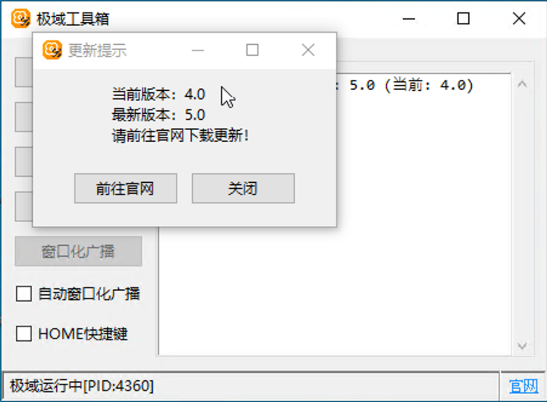
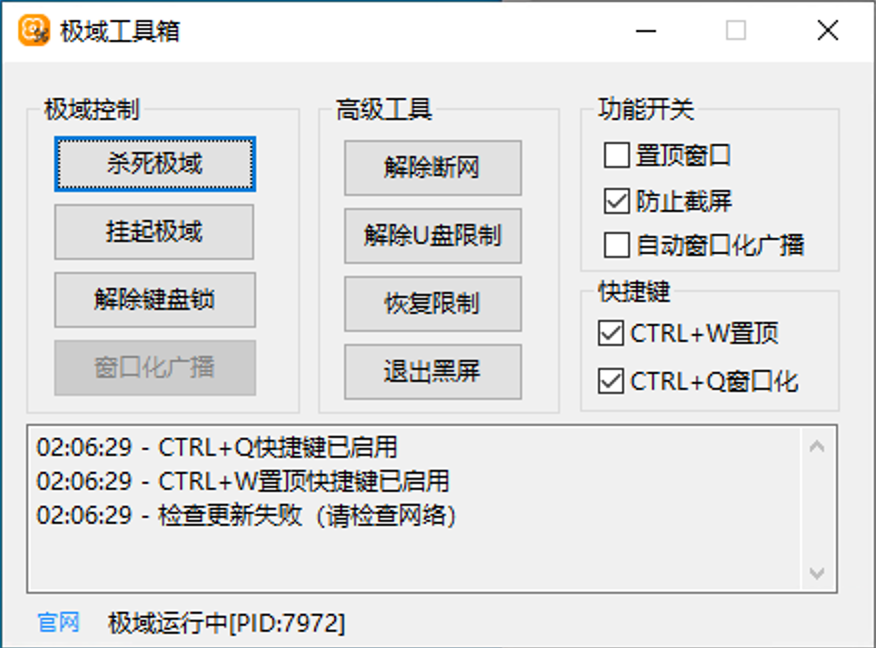
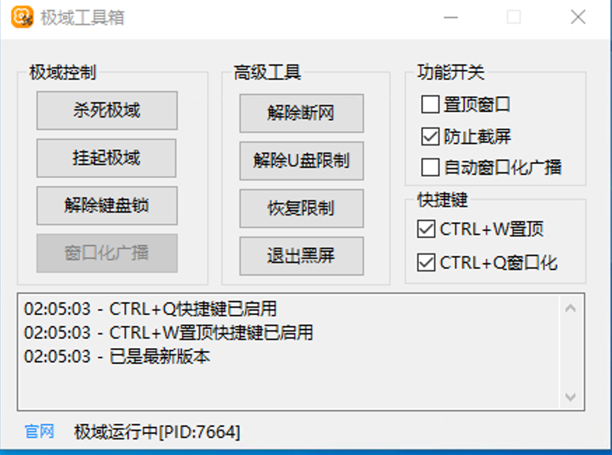
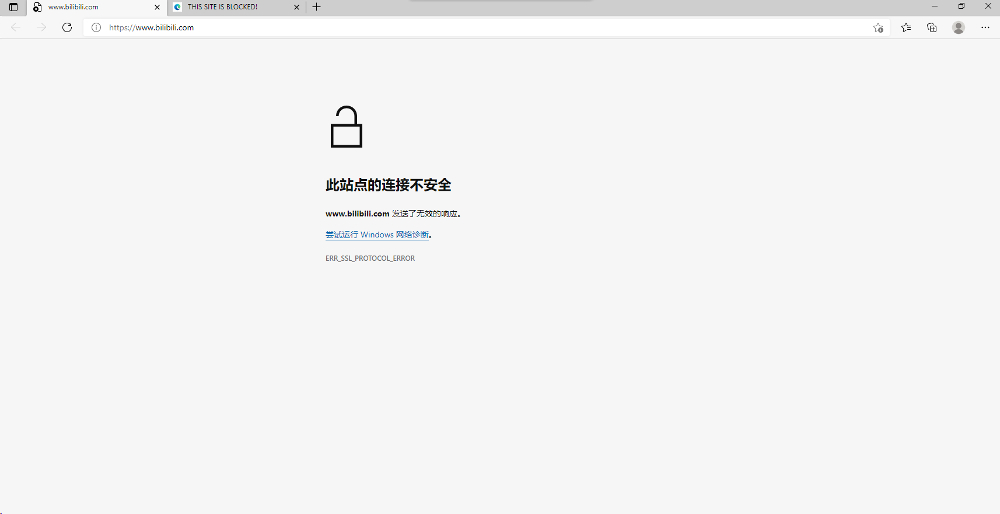
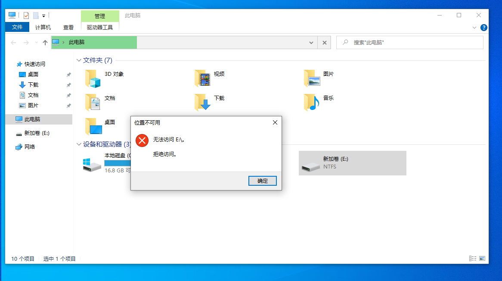
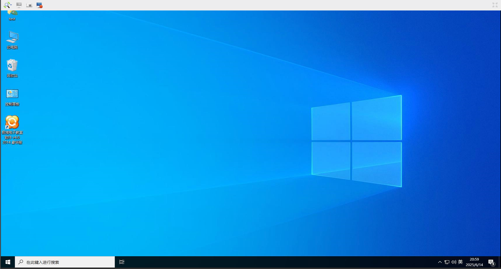
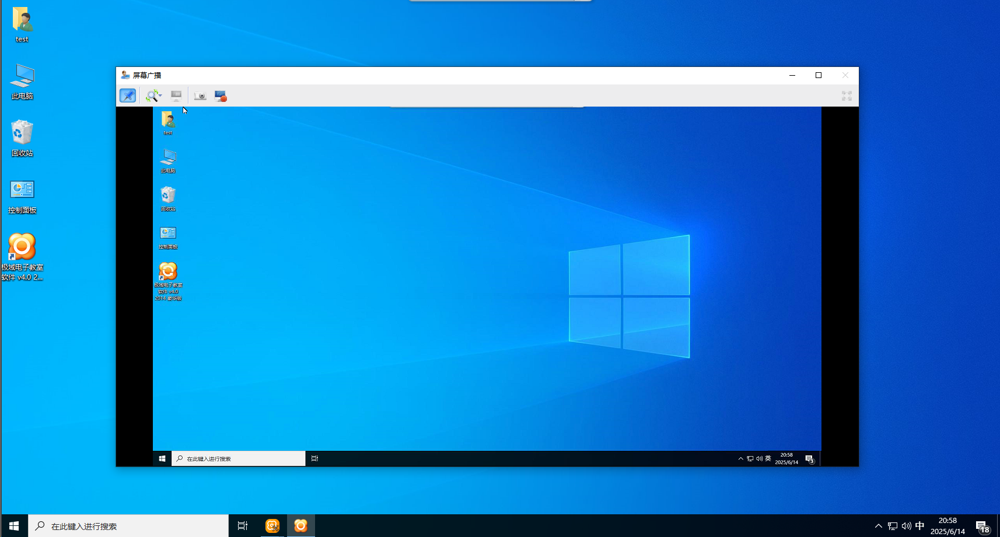

# 使用教程

## 1.下载极域工具箱

在[官网](https://jiyutool.liyixin.vip/)点击下载按钮或[点击这里](https://pan.liyixin.vip/d/public/%E6%9E%81%E5%9F%9F%E5%B7%A5%E5%85%B7%E7%AE%B15.0.exe?sign=3iOcu3SX1x6_XFruf-HA8nwQtz4aIEv1oKXFh9yX-vc=:0)下载工具

## 2.运行极域工具箱

双击运行，如果出现这种提示，说明版本过低，请前往[官网](https://jiyutool.liyixin.vip/)下载最新版

如果提示检查更新失败，请检查网络连接，不过没有网络也可以运行

在成功打开且无报错后点击按钮即可使用（下图为正常运行截图）

## 3.功能介绍

### 解除断网

当出现如下情况时可以尝试此功能来解除断网

### 解除U盘限制

当出现U盘拒绝访问时可以尝试此功能（当然也不排除你的U盘真坏了😅）

### 启动/杀死极域

未检测到极域运行时，点击可启动极域；检测到正在运行时，点击可中止其进程（注意：这样会被老师发现）

### 挂起极域

挂起极域进程（界面卡住、无法操作），此时老师无法对当前电脑使用任何功能（包括屏幕广播、关机等），再次点击可恢复。比杀死进程更隐蔽，不容易被老师发现

### 解除键盘锁

此功能能够让你在老师屏幕广播时正常使用键盘（建议配合下面的"窗口化广播"功能使用）

### 窗口化广播

此功能能够将全屏的屏幕广播改为窗口，此时你可以最小化此窗口干其他事

效果如下

开启前：

开启后：

### 自动窗口化广播

勾选后，在检测到屏幕广播后能够自动窗口化

### 恢复限制

重新开启网络限制以及U盘限制，防止老师发现

### 退出黑屏

一键退出"黑屏安静"

### 置顶窗口

让工具箱窗口始终置顶，防止被极域黑屏/投屏窗口遮挡。勾选"CTRL+W置顶"后，可随时用 CTRL+W 组合键切换置顶状态

### 防止截屏

开启后，工具箱窗口及弹窗将不会被录屏/截图捕捉到，同时，老师在电脑上也无法看到此窗口
